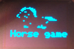
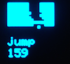
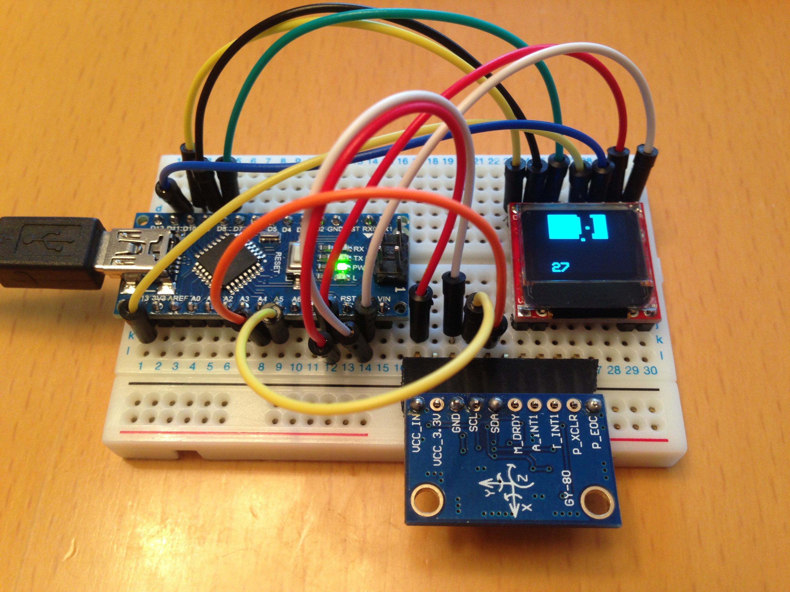
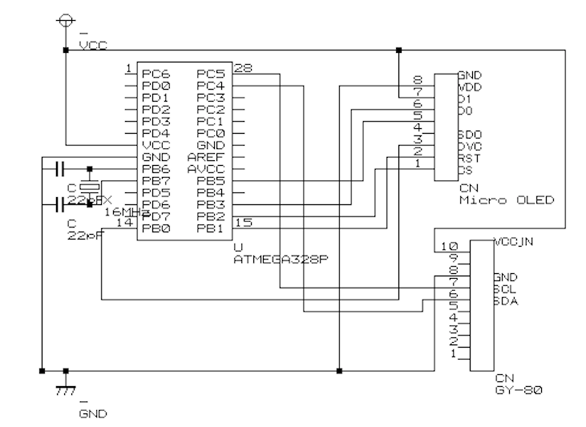

# OLED_game_race  

OLED race game with gyro sensor(GY-80) by arduino nano.  
In schematic picture,using atmega328,but same wiring make it possible to move this game by arduino nano.

OLED: https://www.sparkfun.com/products/13003  
The value of the gyro sensor is corrected by the Kalman filter.
 
Kalman filter's library quoted by :https://github.com/TKJElectronics/KalmanFilter  
GY80: http://selfbuilt.net/shop/gy-80-inertial-management-unit  
File generated by LCD Assistant
 http://en.radzio.dxp.pl/bitmap_converter/  
 This is the easiest way to convert a bmp to an array to make bitmap graph 
    
   
   
 
